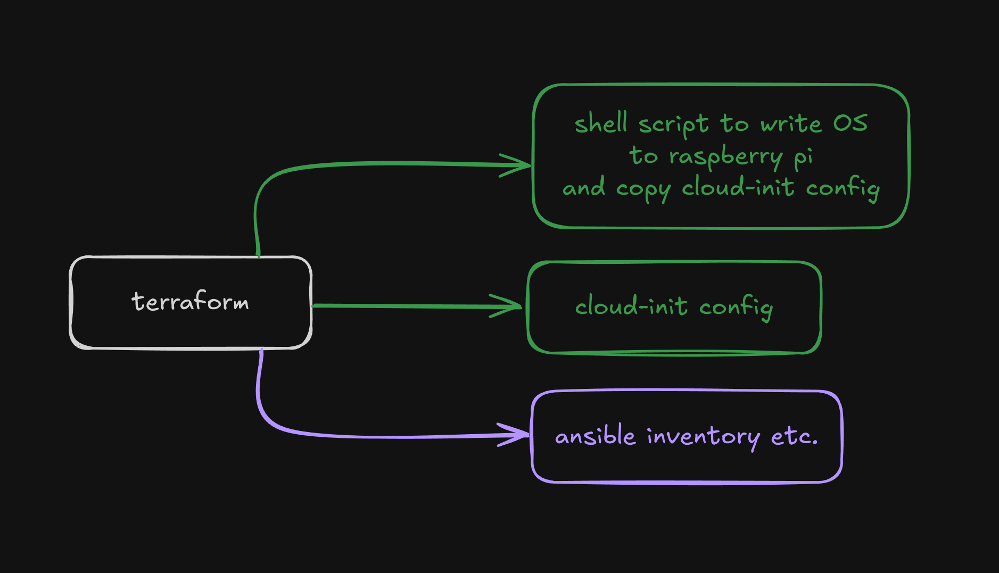

# DevOps Home Lab

To learn and test k8s, gitlab ci, IaC and gitOps principals on raspberry pi home cluster

## Architecture

For the start I use 2 Raspberry Pi to constract bare metal kubernetes cluster:

1. Raspberry Pi 3B+ 1Gb for master node (control plane)
2. Rspberry Pi 5 8Gb for worker node

### Terraform

Terraform in this context acts as an orchestration and configuration management tool rather than a true infrastructure provisioner

#### Replace / Add node

If some `pi` node breaks, or sd card breaks, or add new node:

1. Go to `terraform/variables.tf`/`terraform.tfvars` and check/add new node setup params (mac address, os, services tags, etc.)
2. `terraform apply` new changes. This will generate cloud-init config files and script to write os on SD card for new node in `/terraform/raspberry-pi`
3. Insert SD card and execute `/terraform/raspberry-pi/xxx-prepare-os.sh` script to write os to SD card
4. Insert SD card to `pi` and this should work
